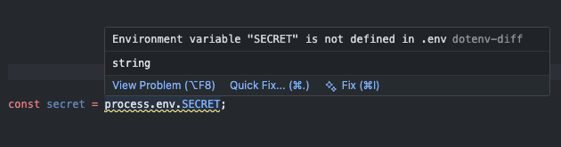
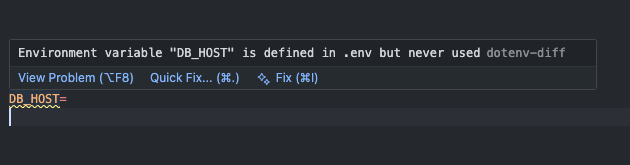

# [VS Code Dotenv-diff](https://marketplace.visualstudio.com/items?itemName=Chrilleweb.dotenv-diff)
> Catch missing and unused environment variables before they catch you.

[](https://marketplace.visualstudio.com/items?itemName=Chrilleweb.dotenv-diff)
[](https://marketplace.visualstudio.com/items?itemName=Chrilleweb.dotenv-diff)
[](https://marketplace.visualstudio.com/items?itemName=Chrilleweb.dotenv-diff)

`vscode-dotenv-diff` is a lightweight VS Code extension that warns you when your `.ts` or `.js` files reference environment variables (`process.env`) that aren't defined in your `.env` file — and when your `.env` file has variables that are never used in your codebase.

> Note: This extension only checks for `process.env` references

---

## Features

### Missing variables in code



If your `.ts` or `.js` file references `process.env.MY_KEY` and `MY_KEY` is not defined in the nearest `.env` file, you'll see a warning underline directly in the editor.

```
Environment variable "MY_KEY" is not defined in .env
```

### Unused variables in `.env`



If a key in your `.env` file is never referenced, the line is flagged with a warning.

```
Environment variable "MY_KEY" is defined but never used
```

### Monorepo support — zero config
The extension automatically finds the nearest `.env` file by walking up the directory tree from your source file. This means you can have multiple `.env` files in a monorepo and the extension will always compare against the correct one.

```
apps/
├── frontend/
│   ├── .env          ← used for files inside frontend/
│   └── src/
│       └── app.ts
└── backend/
    ├── .env          ← used for files inside backend/
    └── src/
        └── server.ts
```

---

## How it works

- Scans **all** `.ts` and `.js` files in your workspace for `process.env.KEY` references
- Parses the **nearest** `.env` file for each source file
- Compares the two and produces warnings

---

## Supported syntax

```typescript
process.env.MY_KEY          // dot notation
process.env["MY_KEY"]       // bracket notation (double quotes)
process.env['MY_KEY']       // bracket notation (single quotes)
```

---

## Requirements

- VS Code `1.109.0` or higher
- A `.env` file somewhere in your project tree

---

## Extension settings

This extension has no configuration. It works out of the box.

---

## Known limitations

- Only `UPPER_CASE` env key names are matched (standard convention)
- Dynamic keys like `` process.env[`key_${name}`] `` are not supported

---

## Documentation

Full documentation is available in the [`docs/`](./docs/index.md) folder:

- [Capabilities](./docs/capabilities.md) — what the extension can do
- [Architecture](./docs/architecture.md) — how the codebase is structured

---

## Feedback & contributions

Found a bug or have a feature request? Open an issue on [GitHub](https://github.com/Chrilleweb/vscode-dotenv-diff/issues).