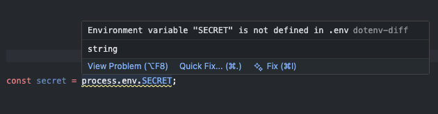
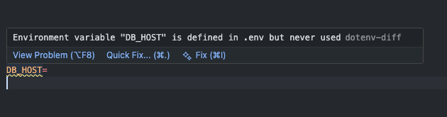
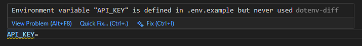
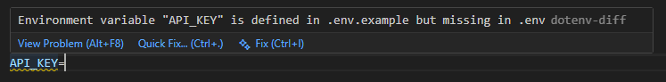

# Capabilities

This document describes everything `vscode-dotenv-diff` can do, and how it behaves in different scenarios.

---

## 1. Missing environment variables

When a source file references an environment variable and that key is not present in the nearest `.env` file, the extension underlines the reference with a warning.



**Example:**

`apps/frontend/.env`
```
DB_HOST=localhost
DB_PORT=5432
```

`apps/frontend/src/app.ts`
```typescript
const host = process.env.DB_HOST;     // defined in .env
const secret = process.env.SECRET;    // not defined in .env
```

**Warning message:**
```
Environment variable "SECRET" is not defined in .env
```

---

## 2. Unused environment variables

When a key is defined in a `.env` file but never referenced anywhere in the workspace, the key is flagged with a warning directly on that line in the `.env` file.



**Example:**

`.env`
```
DB_HOST=
```

**Warning message:**
```
Environment variable "DB_HOST" is defined in .env but never used
```

---

## 3. Missing / unused variables from `.env.example`

Keys in `.env.example` are also checked against the nearest `.env`.
If a key from `.env.example` does not exist in `.env` or is never used, it is flagged with a warning.





**Example:**

`.env.example`
```
API_KEY=
API_URL=
```

`.env`
```
API_URL=https://example.com
```

**Warning message:**
```
Environment variable "API_KEY" is defined in .env.example but missing in .env
```

**Example 2:**

`.env.example`
```
API_KEY=
```

But `API_KEY` is never referenced in any source file.

**Warning message:**
```
Environment variable "API_KEY" is defined in .env.example but never used
```

---

## 4. Monorepo support

The extension automatically finds the nearest `.env` file by walking up the directory tree from the source file. No configuration required.

**Example structure:**
```
apps/
├── frontend/
│   ├── .env              ← used for frontend source files
│   └── src/
│       └── app.ts
├── backend/
│   ├── .env              ← used for backend source files
│   └── src/
│       └── server.ts
└── .env                  ← fallback if no closer .env exists
```

Each source file always resolves to its nearest `.env` — independently of other files.

---

## 5. Supported syntax

The extension recognises the following patterns:

```typescript
// Node.js – dot and bracket notation
process.env.MY_KEY
process.env["MY_KEY"]
process.env['MY_KEY']

// Node.js – destructuring
const { MY_KEY } = process.env
const { MY_KEY: alias, OTHER_KEY = "fallback" } = process.env

// Vite / import.meta
import.meta.env.MY_KEY
import.meta.env["MY_KEY"]
import.meta.env['MY_KEY']

// SvelteKit – dynamic (env object)
import { env } from '$env/dynamic/private';
import { env } from '$env/dynamic/public';
env.MY_KEY

// SvelteKit – static (named imports)
import { MY_KEY } from '$env/static/private';
import { MY_KEY } from '$env/static/public';
import { MY_KEY as alias } from '$env/static/private';
MY_KEY
```

Only `UPPER_CASE` key names are matched, which is the standard convention for environment variables.

Scanned file types: .ts, .js, .mjs, .cjs, .mts, .cts, .svelte

---

## 6. Skipped files

The extension intentionally skips:

- `node_modules/**`
- Test files (`.test.ts`, `.spec.ts` etc.)

---

## Known limitations

- `.env.local`, `.env.production` etc. are not resolved — only `.env` and `.env.example`
- Template literal expressions are scanned, but dynamic key access is not supported:
```typescript
  process.env[`MY_${suffix}`] // not detected
```
